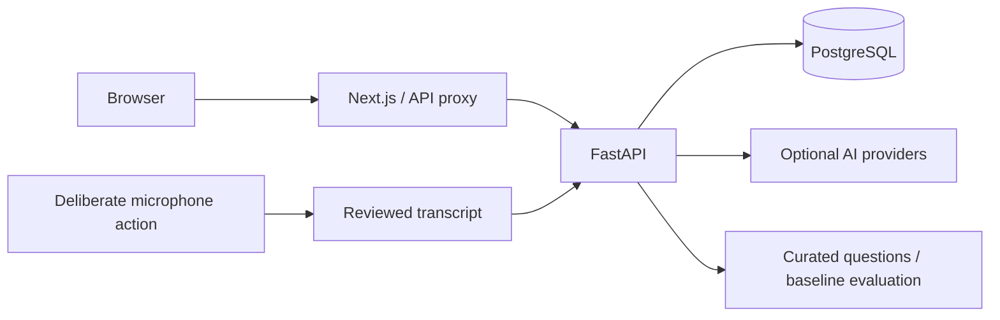

# InterviewAI

A technical interview practice platform for students and job candidates, with personalized context, voice or text answers, structured feedback and progress tracking. Milestones 01–10 are implemented; this repository is prepared for deployment but has not been externally deployed.

## What you can do

- Create an account, sign in securely and manage a candidate profile with normalized technical skills.
- Upload a private PDF/DOCX resume, review extracted skills and compare them with a job description. Matching is a deterministic vocabulary baseline, not a hiring judgment; OCR is unsupported.
- Practice role-specific interviews with recoverable backend drafts and curated questions. Optional AI assistance generates validated questions and adapts difficulty using transparent answer signals.
- Answer with text or deliberately enable microphone recording, playback and transcription. Text remains available without microphone permission, speech support or an API key.
- Review stored technical, reasoning and communication feedback, missed concepts and practical recommendations. No-key evaluation is clearly labeled as a conservative baseline estimate.
- Schedule interviews in your local timezone, reschedule/cancel them and view real history and analytics. Empty accounts show empty states rather than fabricated statistics.
- Optionally enable a lightweight procedural 3D interviewer and read questions aloud with browser speech. Static text/2D fallbacks preserve the entire interview experience.
- Use a role-protected admin area to inspect safe account/profile/resume metadata and history, search accounts and manage explicitly safe account fields. Public users cannot promote themselves.

The landing-page previews are labeled demonstrations. Authenticated dashboards and analytics use actual stored account/interview data. Detailed delivery metrics describe pace and fillers; the application does not infer personality, emotions, identity or truthfulness.

## Stack

| Frontend | Backend | Data and operations |
| --- | --- | --- |
| Next.js App Router, React, strict TypeScript | FastAPI, Pydantic, Python | PostgreSQL, SQLAlchemy 2.x, Alembic |
| Tailwind, Geist, Lucide, semantic dark/light themes | Argon2 password hashing, validated JWT sessions | Docker multi-stage builds, GitHub Actions |
| Lazy Three.js and Recharts, Playwright/Axe | Optional server-only OpenAI, curated fallbacks | Shared PostgreSQL quotas, health/readiness checks |



## Repository

```text
frontend/    App Router pages, shared components, browser tests
backend/     API, schemas, models, services, migrations, isolated tests
config/      One local development address configuration
scripts/     Project-local dev launcher and guarded live validation helpers
docs/        Architecture, security, deployment and milestone decisions
.github/     CI validation; no external deployment automation
```

## Local setup

Use Node.js 24, Python 3.14 and separately installed PostgreSQL. Install missing system runtimes manually. From the repository root in PowerShell:

```powershell
npm --prefix frontend ci
python -m venv backend/.venv
backend/.venv/Scripts/python.exe -m pip install -r backend/requirements-dev.txt
```

Manually create ignored `backend/.env` using [backend/.env.example](backend/.env.example) as its format. Set your dedicated `DATABASE_URL` and a cryptographically random `JWT_SECRET` of at least 32 bytes. URL-encode special characters in database credentials. Never paste secrets into chat, print the file or commit it. `OPENAI_API_KEY` is optional; leave it empty for complete deterministic operation.

From `backend/`, apply reviewed migrations without deleting/recreating your database:

```powershell
.venv/Scripts/python.exe -m alembic upgrade head
```

From the repository root, start the entire application:

```powershell
npm run dev
```

| Service | URL |
| --- | --- |
| Frontend | http://localhost:3000 |
| Backend | http://127.0.0.1:8010 |
| API docs | http://127.0.0.1:8010/docs |
| Liveness | http://127.0.0.1:8010/health |
| Database/JWT/migration readiness | http://127.0.0.1:8010/ready |

PostgreSQL runs separately, normally on port 5432. The root launcher starts both services, provides frontend hot reload and restarts its own backend child on Python edits. It may reuse healthy existing InterviewAI services and stops only processes it started. Local addresses are centralized in `config/development.json`; no unknown port-8000 process needs inspection or termination.

Browser `/api/*` calls use the existing Next.js proxy. Deployment `BACKEND_API_URL` is server-only and supplied **before frontend build**; changing it requires rebuilding. No browser-exposed credential or duplicate API URL configuration is needed.

## AI, audio and session behavior

AI-assisted interviews require candidate opt-in. Profile/resume/job excerpts and recent answers can then be sent to the configured provider. The server validates structured questions/evaluations and falls back on missing keys, invalid output, duplicates, timeouts and failures. Automated tests never make paid calls. Lightweight adaptation is an interview practice heuristic, not a final ability assessment.

Microphone access begins only after Start recording. Recording is visible, tracks stop when finished/hidden/unmounted, and temporary playback is discarded/revoked. Server transcription processes validated WAV audio in memory and closes it after processing; raw recordings are not permanently stored. Browser recognition availability and vendor processing vary. Saved transcripts, durations and feedback persist in PostgreSQL. Pause metrics are omitted when timing is unavailable.

Sessions use HttpOnly, SameSite=Lax JWT cookies, never localStorage. Production cookies are Secure and require HTTPS. Expiry, issuer, audience, integer version and current active account/role are checked. Logout invalidates all account sessions. Writes require a custom header and allowed Origin; credentialed CORS has no wildcard. Shared database quotas protect authentication, interview/provider work and transcription across workers.

## Owner bootstrap and delegated administration

Configure `OWNER_BOOTSTRAP_EMAIL` and a private temporary `OWNER_BOOTSTRAP_PASSWORD` in ignored `backend/.env`. After applying migrations, run from `backend/`:

```powershell
.venv/Scripts/python.exe -m app.cli bootstrap-owner
```

Bootstrap creates/promotes only the configured account, enforces one active owner and is idempotent without resetting an existing password. First login opens `/change-password`; normal APIs remain blocked until the owner chooses a new password. Remove the bootstrap password from the environment after setup. No real password belongs in source, documentation, tests or CLI arguments.

The owner uses `/owner/admins` to create/promote separate admins, assign granular permissions, activate/deactivate, reset temporary passwords and revoke delegation. New/reset admins must change their password too. Only the owner can manage admins; max-permission admins cannot modify the owner or access owner AI/security settings. Safe account APIs never return hashes or tokens. All successful privileged changes produce safe audit events. AI keys remain environment-managed; owner-only status exposes no key.

See [owner control center and permission boundaries](docs/owner-control-center.md). Existing admins receive no automatic permissions during migration; the owner reviews their access explicitly.

## Checks

From `frontend/`:

```powershell
npm run lint
npm run typecheck
npm run build
$env:PLAYWRIGHT_BROWSERS_PATH = Join-Path (Split-Path (Get-Location).Path) '.local/browsers'
npx playwright install chromium --no-shell
npm run test:e2e
```

Mocked browser tests start the production application on port 3107 and cover authenticated workflows, mobile/desktop layouts, light/dark themes, accessibility, microphone denial/unsupported behavior and 3D/speech fallbacks. Keep downloaded browsers inside the repository.

From `backend/`:

```powershell
$env:TEMP = Join-Path (Get-Location).Path 'runtime/tmp'
$env:TMP = $env:TEMP
.venv/Scripts/python.exe -m pytest -q --basetemp=runtime/pytest-local
.venv/Scripts/python.exe -m ruff check app tests alembic
.venv/Scripts/python.exe -m ruff format --check app tests alembic
.venv/Scripts/python.exe -m app.migration_check
.venv/Scripts/python.exe -m pip check
```

Migration validation checks SQLite upgrades/downgrades and metadata parity plus PostgreSQL offline SQL without a live secret. Isolated tests use in-memory SQLite and mocked provider/audio boundaries; these are separate from live PostgreSQL verification.

Run `npm run test:dev-config` at root. For deliberate browser validation against the running development application and configured PostgreSQL, run `npm run test:live` from `frontend/`. It creates a clearly marked temporary account, checks authentication/profile/interviews/results/scheduling/analytics/admin authorization, then deletes only that account and its dependent data. Trace/video/screenshot capture is disabled to avoid retaining authenticated state. No microphone hardware or paid call is required.

## Deployment preparation

See [deployment procedure](docs/deployment.md), [architecture](docs/architecture.md) and [security/privacy](docs/security.md) before public launch. Docker builds use repository-root context filtering, non-root runtimes and standalone frontend output. Compose runs application containers against separately provisioned PostgreSQL. CI validates source, mocked UI, migrations and image builds without deployment or paid AI calls.

Configure HTTPS, production origins and secrets, reviewed migrations, ingress throttling/resource limits, backups and retention/deletion procedures. Local/container resume storage needs a durable volume for one host; distributed production requires a `ResumeStorage` object-storage adapter. Container filesystems are not durable storage. Email verification, public email-based password recovery and comprehensive retention/erasure workflows remain future extensions and are not claimed as implemented.

## Development and security

Milestone branches start from latest `main`; checks precede commits and normal pushes, followed by `--ff-only` into main. Never force push or rewrite published history. Preserve repository-local Git identity and avoid co-author trailers. **Never commit `.env`, credentials, user uploads, recordings or test databases.** Examples contain placeholders only; environments/caches/artifacts are ignored.

Additional decisions: [design system](docs/design-system.md), [authentication](docs/authentication.md), [resume matching](docs/resume-analysis.md), [interview engine](docs/interview-engine.md), [AI fallback](docs/ai-interviewer.md), [voice and evaluation](docs/evaluation-voice.md), [local development](docs/local-development.md).

See [milestones 07–09 verification and validation limits](docs/milestones-07-09.md) for the recorded checks.
