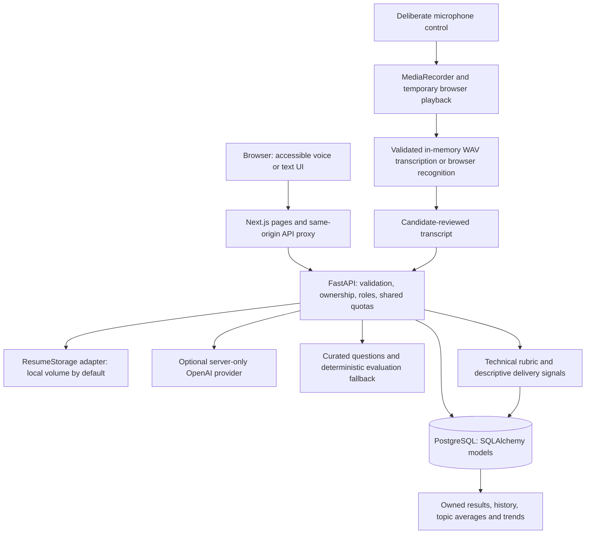

# Architecture

InterviewAI is a Next.js application backed by FastAPI and PostgreSQL. It has not been externally deployed by this milestone.

The frontend sends requests to `/api/*`. A server-side Next.js rewrite forwards them to the backend; the browser never needs an API key or backend token storage. `config/development.json` controls the local addresses. Deployment `BACKEND_API_URL` is a server-only **build-time** override of that single proxy destination. Rebuild the frontend if it changes.

## Persistence and authorization

UUID users own profiles, normalized skill links, resumes, job analyses, interviews and schedules. Interview questions own drafts/submitted answers and versioned evaluations. Schedules store UTC timestamps and link to exactly one interview when started. The API checks schedule availability and transitions; browser countdowns are informational.

Protected routes load the active user from a validated session and current database state. Public registration always creates a `user`. Idempotent environment-driven bootstrap creates the single protected `owner`; only that authenticated owner creates/promotes administrators and delegates permissions. Temporary-password accounts must change password before normal API access. Permissions are normalized database rows checked on every request. Admin DTOs expose permitted safe account/profile fields, resume metadata and history summaries rather than hashes, tokens, raw resumes, private answers or storage keys. Password changes/resets, deactivation, role revocation and logout invalidate session versions. Safe audit events are committed with privileged mutations. See [owner control center](owner-control-center.md).

Alembic revisions are the source of schema changes. `/health` is liveness; `/ready` checks database availability, the expected migration head and usable JWT configuration. Imports do not establish a database connection. Do not use `create_all` against production; it is used only for isolated tests.

## Interviews and fallbacks

The question bank is organized by role, topic and difficulty. Profile, resume and job skills influence selection. Optional AI sessions prepare questions just in time, supply previous question context, validate structured output and reject obvious duplication. Lightweight answer-length/reasoning markers guide difficulty; this is not a final ability assessment.

Each submitted answer receives a stored rubric evaluation. AI evaluation is optional and validated. Missing keys, malformed output, timeouts and provider failures keep the deterministic baseline working. Its keyword/structure estimates are explicitly labeled and conservatively capped; they cannot establish nuanced technical correctness. Results aggregate actual stored evaluations. Analytics average evaluated sessions equally and make trend claims only with enough observations.

Audio is not retained by the backend: a short-lived WAV is validated and transcribed in memory, then closed. Transcript and selected duration are persisted only when the candidate saves/submits an answer. Delivery metrics include word count, conservative filler detection and approximate pace when a duration exists. Pause timing is unavailable and omitted; no emotion, identity, personality or truthfulness inference is performed.

## Client enhancements

The procedural Three.js interviewer is optional and lazy loaded. It depicts a stylized interface character, not a real person. Static artwork remains available without WebGL, on low-capability devices or with reduced motion. Interview text and controls do not depend on 3D rendering. Browser SpeechSynthesis starts only from deliberate controls and can be stopped/replayed. Microphone access starts only after a recording action and tracks stop when recording ends, the page is hidden or the component unmounts.

Recharts is loaded only for analytics. Landing, authentication and dashboard routes do not eagerly import either visualization engine. Keyboard focus, semantic colors and accessible error/loading/empty states are shared across the product.

## Shared request limits

PostgreSQL atomically stores fixed-window counters, so multiple workers share limits. HMAC keys avoid retaining plaintext email/IP identifiers. Failed logins and provider calls still consume reservations. Reservations happen before business-row locks/mutations; rate rejection preserves the interview. Stale buckets are periodically swept. App limits complement ingress connection/body/time limits; see [security](security.md).

## Development and deployment

`npm run dev` launches/reuses healthy local InterviewAI services and watches frontend/Python changes. It terminates only child processes it owns. Docker uses non-root runtime users, separate build stages, filtered contexts and Next.js standalone output. Resume files require a persistent mounted volume for a single instance or a future object-storage adapter for distributed deployment. Container filesystems alone are not durable storage.
